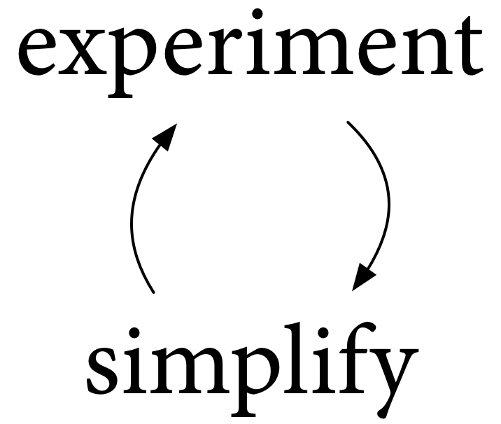
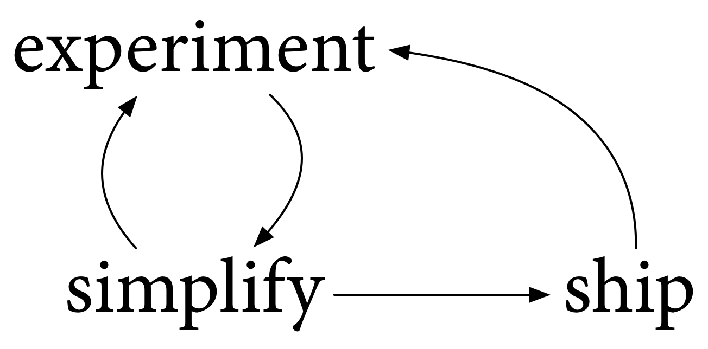
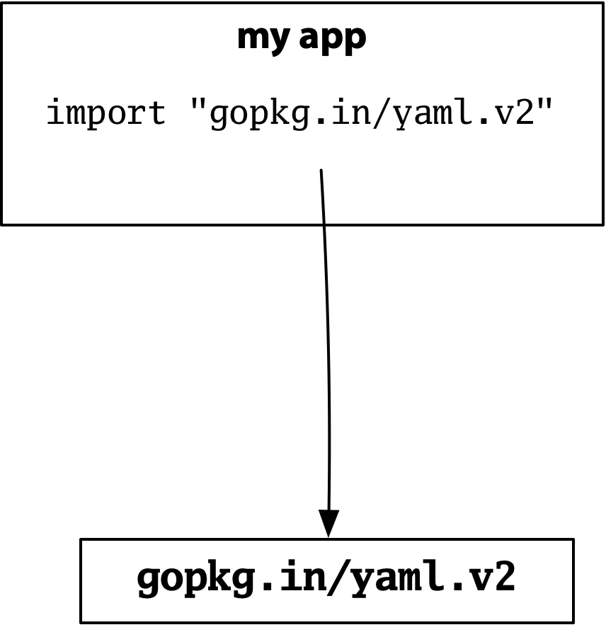
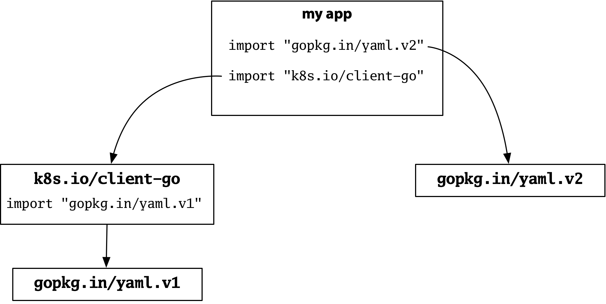

# Go2：实验，简化，出货！

- 中文版
- [English version](experiment-en.md)

## 介绍

[这是我上周在Gophercon 2019上发表的博客文章。我们将在演讲结束后添加视频链接。]

我们都正在一起走向Go 2的路上，但没人知道确切位置和道路。这篇文章讨论了我们如何实际找到并遵循Go2的道路。下面是这个过程的样子。



我们现在尝试使用Go，以便更好地理解它，学习哪些有效，哪些无效。然后我们尝试可能的变化，更好地理解它们，再次学习哪些有效，哪些无效。根据我们从这些实验中学到的东西，我们简化了。然后我们再次进行实验。然后我们再次简化。如此反复。

## 简化的四个R

在这个过程中，我们通过四种主要方式简化编写Go程序的整体体验：重塑（reshaping），重定义（redefining），删除（removing）和限制（restricting）。

### 通过重塑进行简化

我们简化的第一种方法是将存在的内容重新整形为一种新形式，最终让整体更简单。

我们编写的每个Go程序都是一个测试Go本身的实验。在Go的早期，我们很快就知道编写像这样的`addToList`函数这样的代码是很常见的：

```go
func addToList(list []int, x int) []int {
    n := len(list)
    if n+1 < cap(list) {
        big := make([]int, n, (n+5)*2)
        copy(big, list)
        list = big
    }
    list = list[:n+1]
    list[n] = x
    return list
}
```

我们为字节切片和字符串切片编写相同的代码，依此类推。我们的程序写的太复杂了，因为Go太简单了。

所以我们在程序中使用了许多`addToList`函数，并将它们重新整理为Go本身提供的一个函数。添加`append`使得Go语言变得更复杂，但总的来说，即使考虑到学习`append`成本，它也使得编写Go程序的整体体验变得更加简单。

这是另一个例子。对于Go 1，我们查看了Go发行版中的许多开发工具，并将它们重新编写为一个新命令。

```
5a      8g
5g      8l
5l      cgo
6a      gobuild
6cov    gofix         →     go
6g      goinstall
6l      gomake
6nm     gopack
8a      govet
```

这个`go`命令现在如此重要，以至于很容易忘记我们没有它这么长时间以及这个go命令涉及多少额外的工作。

我们在Go发行版中添加了代码和复杂性，但总的来说，我们简化了编写Go程序的经验。新结构也为其他有趣的实验创造了空间，我们稍后会看到。

### 通过重新定义简化

我们简化的第二种方法是重新定义我们已有的功能，允许它做更多。就像通过重塑来简化一样，通过重新定义来简化程序会使程序更容易编写，但现在没有什么新东西需要学习。

例如，`append`最初定义为仅从切片中读取。附加到字节切片时，可以附加来自另一个字节切片的字节，但不能附加字符串中的字节。我们重新定义了append以允许从字符串追加，而不添加任何新的语言。

```go
var b []byte
var more []byte
b = append(b, more...) // ok

var b []byte
var more string
b = append(b, more...) // ok later
```

### 通过删除简化

我们简化的第三种方法是删除功能，因为它已经证明不如我们预期的那么有用或不那么重要。删除功能意味着少学一点，修改错误少一些事情，更少烦恼或更多错误使用。当然，删除还会强制用户更新现有程序，可能会使它们更复杂，以弥补删除。但总体结果仍然是编写Go程序的过程变得更简单。

这方面的一个例子是我们从语言中删除了非阻塞通道操作的布尔形式：

```go
ok := c <- x  // before Go 1, was non-blocking send
x, ok := <-c  // before Go 1, was non-blocking receive
```

这些操作也可以使用`select`，使得需要决定使用哪种形式令人困惑。删除它们简化了语言而不降低其功能。

### 通过限制简化

我们还可以通过限制允许的内容来简化。从第一天开始，Go限制了Go源文件的编码：它们必须是UTF-8。此限制使每个尝试读取Go源文件的程序更简单。这些程序不必担心以Latin-1或UTF-16或UTF-7或其他任何形式编码的Go源文件。

另一个重要的限制是`gofmt`程序格式化。没有什么可以拒绝使用`gofmt`格式化Go代码，但我们已经建立了一个约定，即重写Go程序的工具将它们保留在`gofmt`表单中。如果你的程序也保持不变`gofmt`，那么这些重写器不会进行任何格式更改。当你比较之前和之后，你看到的唯一差异是它真正改变了。这种限制简化程序重写，并导致了像 `goimports`，`gorename`和其他这样成功的实验发生。

## Go开发过程

这个实验和简化循环是我们过去十年来所做过的一个很好的模型。但它有一个问题：它太简单了。我们不能只进行实验和简化。

我们必须公布结果。我们必须使它可以使用。当然，使用它可以实现更多实验，并且可能更加简化，使得流程循环开启。



我们于2009年11月10日首次发布给大家。然后，在你们的帮助下，我们在2011年3月一起发布了Go 1.从那时起我们已经发布了12个Go版本。所有这些都是重要的里程碑，可以进行更多实验，帮助我们更多地了解Go，当然还有Go可供生产使用。

当我们发布Go 1时，我们明确地将注意力转移到使用Go，以便在尝试任何涉及语言更改的简化之前更好地理解该语言版本。我们需要花时间进行实验，真正了解哪些有效，哪些无效。

当然，自Go 1以来我们已经发布了12个版本，因此我们仍在进行实验，简化和发布。但是我们专注于简化Go开发而不需要进行重大语言更改并且不破坏现有Go程序的方法。例如，Go 1.5发布了第一个并发垃圾收集器，然后以下版本改进了它，通过消除暂停时间作为持续关注来简化Go开发。

在2017年的Gophercon，我们宣布经过五年的实验，再次考虑可以简化Go开发的重大变化。我们前往Go2的道路与Go 1的道路非常相似：实验和简化并发布，以实现简化Go开发的总体目标。

对于Go 2，我们认为最重要的具体主题是错误处理，泛型和依赖性。从那时起，我们意识到另一个重要的主题是开发人员工具。

本文的其余部分讨论了我们在每个领域的工作如何遵循这条道路。在此过程中，我们将绕道而行，停止检查Go 1.13中即将发布的错误处理技术细节。

### 错误处理

当要保证所有输入都有效而且正确，并且程序所依赖的任何内容都不能出现错误时，编写一个在所有情况下都能够正常运行的程序很困难。当你在混合着错误提示，编写一个以正确方式工作的程序，无论如何，都会更加困难。

作为思考Go2的一部分，我们想要更好地理解Go是否可以帮助简化这项工作。

有两个不同的方面可能会被简化：错误值和错误语法。我们将依次看看每一个技术，我承诺将重点关注Go1.13错误值的变化。

#### 错误值

错误值必须从某处开始。这是`os`包中`Read`的第一个版本的功能：

```go
export func Read(fd int64, b *[]byte) (ret int64, errno int64) {
    r, e := syscall.read(fd, &b[0], int64(len(b)));
    return r, e
}
```

当时还没有`File`类型，也没有错误类型。 `Read`和包中的其他函数直接从底层的Unix系统调用返回`errno int64`。

此代码已于2008年9月10日下午12:14签入。当时和现在一样，这是一个实验，代码很快就改变了。两小时五分钟后，API发生了变化：

```go
export type Error struct { s string }

func (e *Error) Print() { … } // to standard error!
func (e *Error) String() string { … }

export func Read(fd int64, b *[]byte) (ret int64, err *Error) {
    r, e := syscall.read(fd, &b[0], int64(len(b)));
    return r, ErrnoToError(e)
}
```

这个新API引入了第一种Error类型。错误有了字符串并且可以返回该字符串将其打印到标准错误中。

这里的目的是提供一个概括的整数错误代码，我们从过去的经验中知道操作系统错误数量的表示太有限，它可以简化程序，而不必将有关错误的所有细节都塞进64位字节中。在过去，使用错误字符串对我们来说工作得相当好，所以我们在这里做了同样的事情。这个新的API持续了七个月。

在接下来的四月，在使用接口的更多经验之后，我们决定通过使`os.Error`类型本身成为接口来进一步概括并允许用户定义的错误实现。我们通过删除`Print`方法简化了。

#### 错误是值

创建一个简单的错误interface并允许许多不同的实现，意味着我们可以使用整个Go语言来定义和检查错误。我们喜欢说[错误是值](https://blog.golang.org/errors-are-values)，与任何其他Go值相同。

这是一个例子。在Unix上，尝试拨打网络连接最终使用`connect`系统调用。该系统调用返回一个 `syscall.Errno`，这是一个整数类型的命名，表示系统调用错误号并实现`error`接口：

```go
package syscall

type Errno int64

func (e Errno) Error() string { ... }

const ECONNREFUSED = Errno(61)

    ... err == ECONNREFUSED ...
```

`syscall`为主机操作系统错误号定义了命名常量。这样，在这个系统上，代码可以通过一个函数检测得到一个错误，通过[值相等](https://golang.org/ref/spec#Comparison_operators)的方式判断错误是否为ECONNREFUSED。

进一步来说，`os`中使用更庞大的错误结构来报告任何系统中的调用失败，这些错误结构记录除错误之外还尝试了哪些操作。这里是这些结构中的一小部分，这个`SyscallError`描述了一个错误，它调用了一个特定的系统调用而没有记录其他信息：

```go
package os

type SyscallError struct {
    Syscall string
    Err     error
}

func (e *SyscallError) Error() string {
    return e.Syscall + ": " + e.Err.Error()
}
```

再进一步来说，`net`使用更大的错误结构报告任何网络故障，该错误结构记录周围网络操作的详细信息，例如拨号或侦听，以及涉及的网络和地址：

```go
package net

type OpError struct {
    Op     string
    Net    string
    Source Addr
    Addr   Addr
    Err    error
}

func (e *OpError) Error() string { ... }
```

将这些放在一起，操作`net.Dial`返回的错误可以格式化为字符串，但它们也是结构化的Go数据值。在这种情况下，一个 `net.OpError`错误，它添加了`os.SyscallError`错误，同时也包含了`syscall.Errno`错误值。

```go
c, err := net.Dial("tcp", "localhost:50001")

// "dial tcp [::1]:50001: connect: connection refused"

err is &net.OpError{
    Op:   "dial",
    Net:  "tcp",
    Addr: &net.TCPAddr{IP: ParseIP("::1"), Port: 50001},
    Err: &os.SyscallError{
        Syscall: "connect",
        Err:     syscall.Errno(61), // == ECONNREFUSED
    },
}
```

当我们说错误是值时，我们指的是整个Go语言可用于定义它们，并且整个Go语言可用于检查它们。

这是package net的一个例子。事实证明，当你尝试套接字连接时，大多数情况下你会被连接或拒绝连接，但有时候你可以得到一个没有充分的理由假的`EADDRNOTAVAIL`。Go通过重试来保护用户程序免于此故障模式。要做到这一点，它必须检查错误结构，以确定`syscall.Errno`内部是否包含`EADDRNOTAVAIL`。

这是代码：

```go
func spuriousENOTAVAIL(err error) bool {
    if op, ok := err.(*OpError); ok {
        err = op.Err
    }
    if sys, ok := err.(*os.SyscallError); ok {
        err = sys.Err
    }
    return err == syscall.EADDRNOTAVAIL
}
```

一个[类型断言](https://golang.org/ref/spec#Type_assertions)剥离掉任何`net.OpError`包装。然后第二种类型断言剥离任何`os.SyscallError`包装。然后该函数检查解包的错误是否相等`EADDRNOTAVAIL`。

我们从多年的经验中学到的东西，从Go错误的实验中得知，能够定义错误接口的任意实现，使用完整的Go语言来构造和解构错误，而不需要使用任何单个实现，这是非常强大的。

这些属性 - 错误是值，并且没有一个必需的错误实现 - 对于保留很重要。

不要求一个错误实现，使每个人都能够尝试错误可能提供的其他功能，从而导致许多包的出现，例如：[github.com/pkg/errors](https://godoc.org/github.com/pkg/errors), [gopkg.in/errgo.v2](https://godoc.org/gopkg.in/errgo.v2),[github.com/hashicorp/errwrap](https://godoc.org/github.com/hashicorp/errwrap), [upspin.io/errors](https://godoc.org/upspin.io/errors), [github.com/spacemonkeygo/errors](https://godoc.org/github.com/spacemonkeygo/errors)等等。

但是，无约束实验的一个问题是，作为客户端，您必须编写可能遇到的所有可能实现的并集。 对于Go 2而言似乎值得探索的简化是以商定的可选接口的形式定义常用功能的标准版本，以便不同的实现可以互操作。

#### **Unwrap**

这些包中最常添加的功能是可以调用一些方法来从错误中删除上下文，并在其中返回错误。 包使用不同的名称和含义进行此操作，有时它会删除一个级别的上下文，而有时它会删除尽可能多的级别。

对于Go 1.13，我们引入了一个约定，即向内部错误添加可移动上下文的错误实现应该实现一个`Unwrap`返回内部错误的方法，展开上下文。如果没有适合暴露给调用者的内部错误，则错误不应该有`Unwrap`方法，或者`Unwrap`方法应该返回nil。

```go
// Go 1.13 optional method for error implementations.

interface {
    // Unwrap removes one layer of context,
    // returning the inner error if any, or else nil.
    Unwrap() error
}
```

调用此可选方法的方法是调用辅助函数`errors.Unwrap`，该函数处理错误本身为nil或根本没有`Unwrap`方法的情况。

```go
package errors

// Unwrap returns the result of calling
// the Unwrap method on err,
// if err’s type defines an Unwrap method.
// Otherwise, Unwrap returns nil.
func Unwrap(err error) error
```

我们可以使用Unwrap方法编写一个更简单，更通用的spuriousENOTAVAIL版本。 通用版本可以循环，调用Unwrap来删除上下文，直到它到达EADDRNOTAVAIL或者没有剩下错误，而不是寻找特定的错误包装器实现，如net.OpError或os.SyscallError。

```go
func spuriousENOTAVAIL(err error) bool {
    for err != nil {
        if err == syscall.EADDRNOTAVAIL {
            return true
        }
        err = errors.Unwrap(err)
    }
    return false
}
```

不过，这个循环是如此常见，Go 1.13定义了第二个函数errors.Is，它反复解开查找特定目标的错误。 所以我们可以用一次错误调用替换整个errors.Is：

```go
func spuriousENOTAVAIL(err error) bool {
    return errors.Is(err, syscall.EADDRNOTAVAIL)
}
```

在这一点上，我们甚至可能不会定义函数; `errors.Is`在直接call sites同样清晰，也更简单。

Go 1.13还引入了一个函数`errors.As` ，该函数在找到特定的实现类型之前会解包。

如果要编写适用于任意包装错误的代码， `errors.Is`则是错误相等性检查的包装器感知版本：

```go
err == target

    →

errors.Is(err, target)
```

并且`errors.As`是错误类型断言的包装器感知版本：

```go
target, ok := err.(*Type)
if ok {
    ...
}

    →

var target *Type
if errors.As(err, &target) {
   ...
}
```

#### **Unwrap**还是不**Unwrap**

是否可以解包错误是一种API决策，与导出结构字段是否是API决策的方式相同。 有时将这些细节暴露给调用代码是合适的，有时则不然。 如果是，请执行Unwrap。 如果不是，请不要实施Unwrap。

到目前为止，fmt.Errorf尚未将使用％v格式化的基础错误暴露给调用者检查。 也就是说，fmt.Errorf的结果无法解开。 考虑这个例子：

```go
// errors.Unwrap(err2) == nil
// err1 is not available (same as earlier Go versions)
err2 := fmt.Errorf("connect: %v", err1)
```

如果err2返回给调用者，那个调用者从来没有办法打开err2并访问err1。 我们在Go 1.13中保留了这个属性。

当你想要允许解包fmt.Errorf的结果时，我们还添加了一个新的打印动词％w，其格式类似于％v，需要一个错误值参数，并使得结果错误的Unwrap方法返回该参数。 在我们的示例中，假设我们将％v替换为％w：

```go
// errors.Unwrap(err4) == err3
// (%w is new in Go 1.13)
err4 := fmt.Errorf("connect: %w", err3)
```

现在，如果将err4返回给调用者，则调用者可以使用Unwrap来检索err3。

重要的是要注意绝对规则，如“总是使用％v（或从不实现展开）”或“总是使用％w（或始终实现展开）”与绝对规则一样错误，如“永不导出结构域”或“总是 导出结构字段。“相反，正确的决定取决于调用者是否应该能够检查并依赖于使用％w或实现展开暴露的其他信息。

#### 错误值打印 (Abandoned)

除了Unwrap的设计草案外，我们还发布了一个设计草案，用于更丰富的错误打印的可选方法，包括堆栈帧信息和对本地化翻译错误的支持。

```go
// Optional method for error implementations
type Formatter interface {
    Format(p Printer) (next error)
}

// Interface passed to Format
type Printer interface {
    Print(args ...interface{})
    Printf(format string, args ...interface{})
    Detail() bool
}
```

这个并不像Unwrap那么简单，我不会在这里详述。 当我们在冬天讨论Go社区的设计时，我们了解到设计不够简单。 对于单个错误类型来说，实现起来太难了，并且它对现有程序的帮助不够。 总的来说，它并没有简化Go开发。

通过这次社区讨论，我们放弃了这种打印设计。

#### 错误语法

那是错误值。 让我们简要回顾一下另一个被遗弃的实验的错误语法。

以下是[`compress/lzw/writer.go`](https://go.googlesource.com/go/+/go1.12/src/compress/lzw/writer.go#209)标准库中的一些代码 ：

```go
// Write the savedCode if valid.
if e.savedCode != invalidCode {
    if err := e.write(e, e.savedCode); err != nil {
        return err
    }
    if err := e.incHi(); err != nil && err != errOutOfCodes {
        return err
    }
}

// Write the eof code.
eof := uint32(1)<<e.litWidth + 1
if err := e.write(e, eof); err != nil {
    return err
}
```

一目了然，这段代码大约有一半的错误检查。当我读到它时，我的眼睛茫然。而且我们知道，编写繁琐且阅读繁琐的代码很容易被误读，使其成为难以发现的错误的好地方。例如，这三个错误检查中的一个与其他错误检查不同，这一事实在快速浏览时很容易错过。如果您正在调试此代码，需要多长时间才能注意到这一点？

在去年的Gophercon，我们 [提出了](https://golang.org/design/go2draft-error-handling) 一个由关键字标记的新控制流结构[的草图设计](https://golang.org/design/go2draft-error-handling)`check`。 `Check`使用函数调用或表达式的错误结果。如果错误是非nil，则`check`返回错误。否则，`check`评估调用的其他结果。我们可以`check`用来简化lzw代码：

```go
// Write the savedCode if valid.
if e.savedCode != invalidCode {
    check e.write(e, e.savedCode)
    if err := e.incHi(); err != errOutOfCodes {
        check err
    }
}

// Write the eof code.
eof := uint32(1)<<e.litWidth + 1
check e.write(e, eof)
```

此版本的相同代码使用`check`，它删除了四行代码，更重要的是突出显示`e.incHi`允许返回的调用`errOutOfCodes`。

也许最重要的是，该设计还允许在以后的检查失败时运行定义错误处理程序块。这样您就可以只编写一次共享上下文添加代码，就像在此片段中一样：

```go
handle err {
    err = fmt.Errorf("closing writer: %w", err)
}

// Write the savedCode if valid.
if e.savedCode != invalidCode {
    check e.write(e, e.savedCode)
    if err := e.incHi(); err != errOutOfCodes {
        check err
    }
}

// Write the eof code.
eof := uint32(1)<<e.litWidth + 1
check e.write(e, eof)
```

从本质上讲，check是编写if语句的简短方法，而handle类似于defer但仅适用于错误返回路径。 与其他语言中的异常相反，此设计保留了Go的重要属性，即每个潜在的失败调用都在代码中明确标记，现在使用check关键字而不是`if err != nil`。

这种设计的一个大问题是，`handle`重叠太多，并且以混乱的方式`defer`。

在五月，我们发布了一个[新的设计](https://golang.org/design/32437-try-builtin)，有三个简化：为了避免与延迟的混淆，设计放弃了处理，而只是使用延迟; 为了匹配Rust和Swift中的类似想法，设计重命名为check to try; 并且允许以像gofmt这样的现有解析器识别的方式进行实验，它将检查（现在尝试）从关键字更改为内置函数。

现在相同的代码看起来像这样：

```go
defer errd.Wrapf(&err, "closing writer")

// Write the savedCode if valid.
if e.savedCode != invalidCode {
    try(e.write(e, e.savedCode))
    if err := e.incHi(); err != errOutOfCodes {
        try(err)
    }
}

// Write the eof code.
eof := uint32(1)<<e.litWidth + 1
try(e.write(e, eof))

```

我们花了六月的大部分时间在GitHub上公开讨论这个提案。

检查或尝试的基本思想是缩短每次错误检查时重复的语法量，特别是从视图中删除return语句，保持错误检查显式并更好地突出显示有趣的变化。 然而，在公众反馈讨论中提出的一个有趣的观点是，如果没有明确的if语句和返回，就没有地方可以放置调试打印，没有地方可以设置断点，并且没有代码显示为代码覆盖率结果中未执行的代码。 我们所获得的好处是以使这些情况变得更加复杂为代价的。 总的来说，从这个以及其他考虑因素来看，总体结果并不是很简单的Go开发，所以我们放弃了这个实验。

这就是错误处理的一切，这是今年的主要焦点之一。

### 泛型

现在有点争议的东西：泛型。

我们为Go 2确定的第二个重要主题是使用类型参数编写代码的某种方式。 这样就可以编写通用数据结构，也可以编写适用于任何切片，任何类型的通道或任何类型的映射的通用函数。 例如，这是一个通用的通道过滤器：

```go
// Filter copies values from c to the returned channel,
// passing along only those values satisfying f.
func Filter(type value)(f func(value) bool, c <-chan value) <-chan value {
    out := make(chan value)
    go func() {
        for v := range c {
            if f(v) {
                out <- v
            }
        }
        close(out)
    }()
    return out
}
```

自从Go开始工作以来，我们一直在考虑泛型，我们在2010年编写并拒绝了我们的第一个具体设计。我们在2013年底之前编写并拒绝了另外三个设计。四个废弃的实验，但没有失败的实验，我们从 他们，就像我们从检查和尝试中学到的一样。 每一次，我们都知道Go 2的路径并不是那个确切的方向，我们注意到其他方向可能很有趣。 但到了2013年，我们已经决定我们需要关注其他问题，所以我们将整个主题放在一边几年。

去年我们又开始进行探索和实验，去年夏天，我们在Gophercon的基础上提出了一个基于合约理念的新设计。 我们一直在进行实验和简化，我们一直在与编程语言理论专家合作，以更好地理解设计。

总的来说，我希望我们朝着一个良好的方向前进，朝着一个简化Go开发的设计。 即便如此，我们可能会发现这种设计也不起作用。 我们可能不得不放弃这个实验，并根据我们学到的东西调整我们的路径。 我们会发现。

在Gophercon 2019年，Ian Lance Taylor谈到了为什么我们可能想要向Go添加泛型并简要预览最新的设计草案。 有关详细信息，请参阅他的博文[“Go：为何带来泛型”](https://github.com/llgoer/go-generics)。

### 依赖

我们为Go 2确定的第三个主题是依赖管理。

2010年，我们发布了一个名为goinstall的工具，我们将其称为“包安装实验”。它下载了依赖项并将它们存储在GOROOT的Go分发树中。

#### 兼容性

goinstall实验故意遗漏了包版本控制的明确概念。 相反，goinstall总是下载最新的副本。 我们这样做了，所以我们可以专注于包安装的其他设计问题。

Goinstall成为Go 1的一部分。当人们询问版本时，我们鼓励他们通过创建其他工具进行实验，他们做到了。 我们鼓励包AUTHORS为他们的USERS提供与Go 1库相同的向后兼容性。 引用[Go常见问题解答](https://golang.org/doc/faq#get_version)：

*“供公众使用的软件包应尽量保持向后兼容性。*

*如果需要不同的功能，请添加新名称，而不是更改旧名称。*

*如果需要完全中断，请使用新的导入路径创建一个新包。“*

该约定通过限制作者可以做的事情简化了使用包的整体体验：避免破坏对API的更改; 为新功能赋予新名称; 并为全新的包装设计提供新的进口途径。

当然，人们一直在试验。 其中一个最有趣的实验是由Gustavo Niemeyer开始的。 他创建了一个名为[gopkg.in](https://gopkg.in/)的Git重定向器，它为不同的API版本提供了不同的导入路径，以帮助包作者遵循为新包装设计提供新导入路径的惯例。

例如，GitHub存储库中的Go源代码[go-yaml/yaml](https://github.com/go-yaml/yaml)在v1和v2语义版本标记中具有不同的API。 gopkg.in服务器为它们提供了不同的导入路径[gopkg.in/yaml.v1](https://godoc.org/gopkg.in/yaml.v1)和[gopkg.in/yaml.v2](https://godoc.org/gopkg.in/yaml.v2)。

提供向后兼容性的惯例，以便可以使用较新版本的软件包代替旧版本，这使得即使在今天也能很好地实现“始终下载最新版本”的规则。

#### 版本控制和供应

但是在生产环境中，您需要更加精确地了解依赖版本，以使构建可重现。

许多人尝试了应该是什么样子，构建满足他们需求的工具，包括Keith Rarick的goven（2012）和godep（2013），Matt Butcher的glide（2014）和Dave Cheney的gb（2015）。 所有这些工具都使用将依赖包复制到您自己的源代码控制存储库中的模型。 用于使这些包可用于导入的确切机制各不相同，但它们都比它们看起来要复杂得多。

在社区范围的讨论之后，我们采用了Keith Rarick的提议，即在没有GOPATH技巧的情况下为复制的依赖项添加明确的支持。 这通过重塑来简化：与addToList和append一样，这些工具已经实现了这个概念，但它比它需要的更尴尬。 添加对vendor目录的显式支持使这些使用更加简单。

go命令中的运输vendor目录导致了更多的vendoring itself实验，我们意识到我们已经引入了一些问题。 最严重的是我们失去了包装的独特性。 之前，在任何给定的构建期间，导入路径可能出现在许多不同的包中，并且所有导入都引用相同的目标。 现在有了vendoring，不同包中的相同导入路径可能会引用包的不同vendored副本，所有这些副本都会出现在最终生成的二进制文件中。

当时，我们没有这个属性的名称：包唯一性。 这就是GOPATH模型的工作原理。 直到它消失，我们才完全欣赏它。

这里有一个并行检查和尝试错误语法提议。 在这种情况下，我们依赖于可见返回语句如何在我们考虑删除之前以我们不理解的方式工作。

当我们添加vendor目录支持时，有许多不同的工具来管理依赖项。 我们认为关于vendor目录和销售元数据的格式的明确协议将允许各种工具进行互操作，就像关于Go程序如何存储在文本文件中的协议一样，可以实现Go编译器，文本编辑器和类似工具之间的互操作。 goimports和gorename。

事实证明这是天真的乐观。 vendoring工具都以微妙的语义方式不同。 互操作需要将它们全部改为同意语义，可能会破坏各自的用户。 融合没有发生。

#### **Dep**

在2016年的Gophercon，我们开始尝试定义一个管理依赖项的工具。 作为这项工作的一部分，我们与许多不同类型的用户进行了调查，以了解他们在依赖关系管理方面需要什么，并且团队开始研究新工具，后者变成了dep。

Dep旨在能够替换所有现有的依赖管理工具。 目标是通过将现有的不同工具重塑为单一工具来简化。 它部分完成了。 Dep还通过在项目树顶部只有一个vendor目录来恢复其用户的包唯一性。

但dep也引入了一个严重的问题，让我们花了一段时间才完全发现。 问题在于dep包含了滑行的设计选择，支持和鼓励对给定包的不兼容更改而不改变导入路径。

这是一个例子。 假设您正在构建自己的程序，并且需要一个配置文件，因此您使用流行的Go YAML包的第2版：



现在假设您的程序导入Kubernetes客户端。 事实证明，Kubernetes广泛使用YAML，它使用相同流行软件包的版本1：



版本1和版本2具有不兼容的API，但它们也具有不同的导入路径，因此对于给定导入的含义没有歧义。 Kubernetes获得版本1，您的配置解析器获得版本2，一切正常。

Dep放弃了这个模型。 yaml包的版本1和版本2现在具有相同的导入路径，从而产生冲突。 对两个不兼容的版本使用相同的导入路径，结合包唯一性，使得无法构建您之前可以构建的程序：


我们花了一段时间来理解这个问题，因为我们长期以来一直在应用“新API意味着新的导入路径”惯例，以至于我们认为这是理所当然的。 dep实验帮助我们更好地理解了这个约定，并且我们给它起了一个名字：导入兼容性规则：

*“如果旧软件包和新软件包具有相同的导入路径，则新软件包必须向后兼容旧软件包。”*

#### **Go Modules**

我们在dep实验中取得了很好的效果，并且了解了哪些方法效果不佳，我们尝试了一种名为vgo的新设计。 在vgo中，包遵循导入兼容性规则，因此我们可以提供包唯一性，但仍然不会像我们刚看到的那样破坏构建。 这让我们也简化了设计的其他部分。

除了恢复导入兼容性规则之外，vgo设计的另一个重要部分是为一组包的概念赋予名称，并允许将该分组与源代码存储库边界分开。 一组Go包的名称是一个模块，因此我们现在将系统称为Go模块。

#### 取代GOPATH

使用Go模块将GOPATH作为全局名称空间结束。 从远离GOPATH开始，将现有的Go用法和工具转换为模块的几乎所有艰苦工作都是由于这种变化造成的。

GOPATH的基本思想是GOPATH目录树是正在使用的版本的全局真实来源，并且当您在目录之间移动时，所使用的版本不会改变。 但是，全局GOPATH模式与每个项目可重现构建的生产要求直接冲突，这本身就以许多重要方式简化了Go开发和部署体验。

每个项目可重现的构建意味着当您在项目A的检出工作时，您将获得与项目A的其他开发人员在该提交中获得的相同的依赖项版本集，如go.mod文件所定义。 当您切换到项目B的结帐时，现在您可以获得该项目选择的依赖版本，与项目B的其他开发人员获得的版本相同。 但是那些可能与项目A不同。当你从项目A转移到项目B时，依赖版本的变化是必要的，以使你的开发与A和B上的其他开发人员的开发保持同步。不可能有 单一的全局GOPATH了。

采用模块的大多数复杂性直接源于一个全局GOPATH的丢失。 包的源代码在哪里？ 之前，答案仅取决于您的GOPATH环境变量，大多数人很少更改。 现在，答案取决于您正在进行的项目，这可能经常发生变化。 一切都需要更新这个新的约定。

大多数开发工具使用该 [`go/build`](https://godoc.org/go/build)包来查找和加载Go源代码。我们保持该程序包正常运行，但API没有预期模块，我们为避免API更改而添加的变通方法比我们想要的慢。我们已经发布了一个替代品[`golang.org/x/tools/go/packages`](https://godoc.org/golang.org/x/tools/go/packages)。开发人员工具现在应该使用它。它支持GOPATH和Go模块，使用起来更快更容易。在一两个版本中，我们可以将其移动到标准库中，但是现在[`golang.org/x/tools/go/packages`](https://godoc.org/golang.org/x/tools/go/packages) 是稳定的并且可以使用。

#### Go**模块代理**

模块简化Go开发的方法之一是将一组包的概念与存储它们的底层源控制存储库分开。

当我们与Go用户讨论依赖关系时，几乎所有在他们公司使用Go的人都询问如何通过他们自己的服务器路由获取包，以更好地控制可以使用的代码。 甚至开源开发人员都担心依赖关系会消失或意外地发生变化，从而破坏他们的构建。 在模块之前，用户尝试了解决这些问题的复杂解决方案，包括拦截go命令运行的版本控制命令。

Go模块设计可以很容易地引入模块代理的概念，可以询问特定模块版本。

现在，公司可以轻松运行自己的模块代理，并提供有关允许内容和缓存副本存储位置的自定义规则。[雅典](https://docs.gomods.io/)开源[项目](https://docs.gomods.io/)建立了这样一个代理，Aaron Schlesinger在Gophercon 2019上对此进行了讨论。（当视频可用时，我们将在这里添加一个链接。）

对于个人开发人员和开源团队，Google的Go团队已经[启动了一个代理](https://groups.google.com/forum/#!topic/golang-announce/0wo8cOhGuAI)，作为所有开源Go软件包的公共镜像，Go 1.13将在模块模式下默认使用该代理。Katie Hockman在Gophercon 2019上谈到了这个系统。（当视频可用时，我们会在这里添加一个链接。）

#### **Go模块状态**

将1.11介绍模块作为实验性的选择预览。 我们不断尝试和简化。 Go1.12发布改进，Go 1.13将提供更多改进。

模块现在处于我们认为它们将为大多数用户服务的程度，但我们尚未准备好关闭GOPATH。 我们将继续进行实验，简化和修改。

我们完全认为Go用户社区围绕GOPATH构建了近十年的经验，工具和工作流程，并且将所有这些转换为Go模块需要一段时间。

但同样，我们认为模块现在可以很好地适用于大多数用户，我建议您在Go 1.13发布时查看。

作为一个数据点，Kubernetes项目有很多依赖项，他们已经迁移到使用Go模块来管理它们。你可能也可以。如果您不能，请通过[提交错误报告](https://golang.org/issue/new)告诉我们什么不适合您或什么太复杂，我们将进行实验和简化。

## 工具

错误处理，泛型和依赖关系管理至少需要几年时间，我们现在将重点关注它们。 错误处理已接近完成，模块将在此之后接下来，之后可能是泛型。

但是假设我们看了几年，那时我们已经完成了实验和简化，并且已经发布了错误处理，模块和泛型。 那又怎样？ 预测未来是非常困难的，但我认为，一旦这三个已经出货，这可能标志着重大变化的新平静时期的开始。 我们在这一点上的重点可能转向使用改进的工具简化Go开发。

一些工具工作已经在进行中，所以这篇文章通过查看完成。

虽然我们帮助更新了所有Go社区现有的工具以了解Go模块，但我们注意到，拥有大量开发帮助工具，每个工具都做一个小工作，并不能很好地为用户服务。 单个工具太难以组合，调用太慢而且使用太不同。

我们开始努力将最常用的开发助手统一到一个工具中，现在称为gopls（发音为“go，please”）。 Gopls使用语言[服务器协议LSP](https://langserver.org/)，并且可以与支持LSP的任何集成开发环境或文本编辑器一起使用，这基本上是此时的所有内容。

`Gopls`标志着Go项目的重点扩展，从提供类似编译器的命令行工具（如go vet或gorename）到提供完整的IDE服务。Rebecca Stambler `gopls`在Gophercon 2019上发表了有关IDE和IDE的更多细节的演讲。（当视频可用时，我们将在此处添加链接。）

之后`gopls`，我们也有了`go fix`以可扩展的方式恢复并提供`go vet`更多帮助的想法。

## 结尾


这是通往Go 2 的道路，我们要不断地尝试并简化，并且把这个信息传递出去，反复地尝试并简化，不停地进行这样的过程。 每次我们进行实验和简化时，我们都会更多地了解Go 2应该是什么样子，并向它迈进一步。 即使是遗弃的实验，如尝试或我们的前四个泛型设计或dep也不浪费时间。 它们帮助我们在出货之前了解需要简化的内容，在某些情况下，它们可以帮助我们更好地理解我们认为理所当然的事情。

在某些时候，我们会意识到我们已经进行了足够的实验，并且已经足够简化并且运输得足够多，我们将拥有Go2。

感谢Go社区中的所有人帮助我们在这条道路上进行实验，简化和出货。

作者：*Russ Cox*

原文：https://blog.golang.org/experiment

译文：https://github.com/llgoer/go-generics